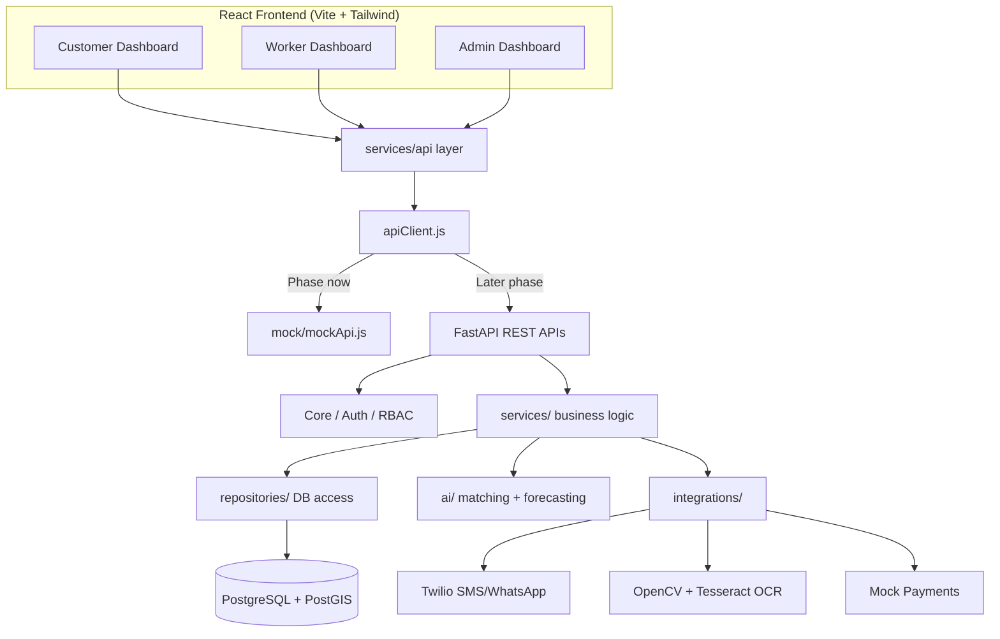
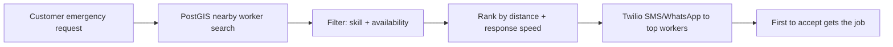
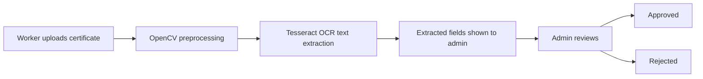

# SevaSangam — System Architecture

> Place at: `docs/architecture/system-architecture.md`

## 1. High-level architecture



## 2. Booking flow (normal)

```mermaid
flowchart LR
    Cust[Customer selects service + location] --> Match[AI Smart Matching]
    Match --> List[Ranked worker list: skill+distance+rating+workload]
    List --> Confirm[Customer confirms worker]
    Confirm --> Notify1[Worker notified via Twilio]
    Notify1 --> Accept[Worker accepts]
    Accept --> Complete[Service completed]
    Complete --> Payment[Payment status: Pending/Paid/Cash]
    Payment --> Invoice[Digital invoice generated]
    Invoice --> Rate[Customer rates worker]
```



## 3. Emergency flow



## 4. Certificate verification flow



## 5. Role-based access

```mermaid
flowchart TD
    Login[Login] --> Role{Role?}
    Role -->|Customer| CustomerRoute[/customer/*]
    Role -->|Worker| WorkerRoute[/worker/*]
    Role -->|Admin| AdminRoute[/admin/*]
    CustomerRoute -.blocked.-> WorkerRoute
    WorkerRoute -.blocked.-> AdminRoute
```

## 6. Data flow layers (both frontend and backend)

```
React Component
      ↓
Custom Hook (useBookings, useWorkers, ...)
      ↓
API Service (bookingApi.js, workerApi.js, ...)
      ↓
API Client (apiClient.js)
      ↓
mock/mockApi.js   ← current phase
FastAPI backend    ← future phase (same call signature, drop-in swap)
```

```
FastAPI Route (thin, no logic)
      ↓
Service (business logic: matching_service.py, booking_service.py, ...)
      ↓
Repository (DB access only)
      ↓
PostgreSQL + PostGIS
```

AI (`ai/matching`, `ai/forecasting`) and Integrations (`integrations/twilio`, `integrations/ocr`, `integrations/payments`) are called **from services**, never directly from routes.
